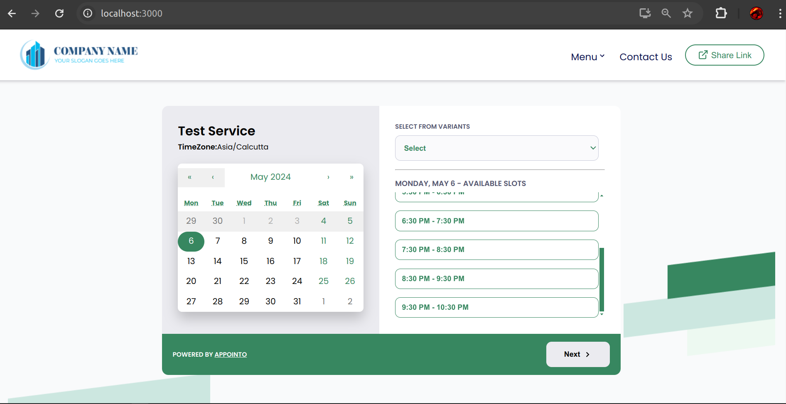

## Objective

- Develop a dynamic appointment booking screen for our app using React.

## How to run the project

- fork the project to your github and pull the code into your local machine.
- once you have the local code reaady , open the trminal and run `npm install`
- once npm install is successful, you can run `npm start` to start the app
- Once the app is successfully launched you can see it on localhost:3000.(depends on your machine)

## Tech stack used

- React
- HTML,CSS, JavaScript
- react calender: for displaying the calender
- react redux and react redux toolkit for managing the states.
- react icons for icons
- poppins font
- moment timezone to convert all the dates and time to different formats.

## Validations checked

- user cannot select previous date for booking.
- added overflow in the timeslots section so that we can accomdate n number of timeslots in limited space.
- used next buuton to show the booking information.
  - It will not be enabled until a user selects a slot and a booking date.
- I have assumed that the `select from variants` is an optional feild.
  - if user does not select the variant then all the slots irrespective of the duration will be shown.
  - it has no involvement with fetching the data and is solely responsible forthe filter part.
- I have tried to copy each and every description os style from the figma provided, and have made it responsive too.
- for optimization I have use useMemo, usecallback hooks.
- the lazyloading didnt felt necessary as the app was not too big and idnt have lots of components.
- for keeping the fetch logic and handling errors , I have created a custom hook that takes care of it.
- redux is used for managing the states.
- I havent used plain css from a long time so it was a good revision, took a lot of search to figure out some specific css.
